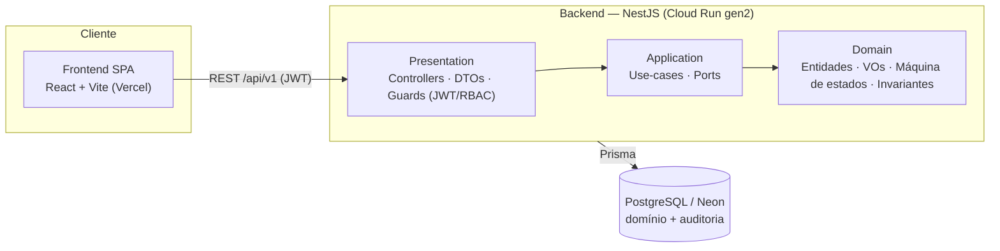
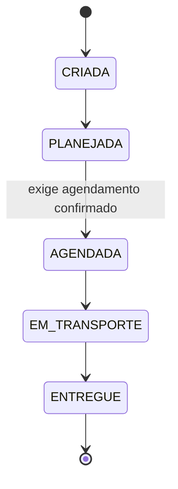

# OVGS — Sistema de Gestão de Ordens de Venda

Solução full stack para gerir o ciclo de vida completo de **Ordens de Venda
(OVs)** — cadastros, criação e acompanhamento, central de agendamento e
auditoria — proposta para o desafio técnico.

Monorepo com **backend NestJS (Clean Architecture)** e **frontend React + Vite**.

## 🔗 Demo ao vivo

| | URL |
|---|---|
| **Frontend** (Vercel) | https://desafio-suzano-ovgs.vercel.app |
| **API** (Cloud Run gen2) | https://ovgs-api-yj5p2mqehq-uc.a.run.app |
| **Swagger / OpenAPI** | https://ovgs-api-yj5p2mqehq-uc.a.run.app/docs |

Login: `operador@ovgs.dev` / `operador123` (OPERADOR) · `auditor@ovgs.dev` / `auditor123` (AUDITOR).

> **Fio condutor da solução:** o ciclo de vida da Ordem de Venda é uma **máquina
> de estados auditável**. O domínio é a fonte da verdade do estado operacional;
> cada transição é uma invariante de negócio explícita; e toda mudança relevante
> gera um evento de auditoria imutável na mesma transação. A regra de negócio
> central: *uma OV só nasce se o tipo de transporte estiver autorizado para o
> cliente.*

## Stack

| | |
|---|---|
| **Backend** | Node 22 · TypeScript · NestJS 11 · Prisma 6 · PostgreSQL 16 · JWT (access + refresh) · RBAC · Swagger · Jest (Istanbul, ≥95%) |
| **Frontend** | React 19 · Vite · TypeScript · TanStack Query · Zod · React Hook Form · Cypress |
| **Infra** | Docker Compose · GitHub Actions (CI) · Cloud Run function gen2 (backend) · Vercel (frontend) · Neon (Postgres gerenciado) |

## Estrutura do monorepo

```
desafio-suzano/
├── backend/    # API NestJS (Clean Architecture) — ver backend/README.md
├── frontend/   # SPA React + Vite — ver frontend/README.md
├── docs/       # documentação complementar (arquitetura, modelagem, plano)
├── docker-compose.yml
└── .github/workflows/ci.yml
```

## Arquitetura



### Máquina de estados da Ordem de Venda



Transições fora dessa sequência são rejeitadas (`422`).

## Como executar (local)

```bash
# 1. Banco (Docker). Use POSTGRES_PORT=5433 se a 5432 estiver ocupada.
docker compose up -d postgres

# 2. Backend
cd backend
cp .env.example .env
pnpm install
pnpm prisma migrate deploy && pnpm prisma:seed
pnpm start:dev            # http://localhost:8080 · Swagger em /docs

# 3. Frontend (em outro terminal)
cd frontend
cp .env.example .env      # VITE_API_URL=http://localhost:8080
pnpm install
pnpm dev                  # http://localhost:5173
```

Ou tudo via Docker: `docker compose --profile full up --build` (sobe banco +
backend com migrations aplicadas).

**Credenciais semeadas:** `operador@ovgs.dev` / `operador123` (OPERADOR) ·
`auditor@ovgs.dev` / `auditor123` (AUDITOR).

## Testes

```bash
# backend: unitários + cobertura (gate 95%) e integração e2e
cd backend && pnpm test:cov && pnpm test:e2e
# frontend: cypress (component + e2e) com cobertura
cd frontend && pnpm cy:run
```

## Mapa de requisitos do desafio

| Requisito | Onde |
|---|---|
| Cadastro de clientes / tipos de transporte / itens | módulos `clientes`, `tipos-transporte`, `itens` |
| Tipos de transporte autorizados por cliente | `Cliente.transporteEstaAutorizado` + endpoints `/clientes/:id/transportes` |
| OV: 1 cliente, 1 transporte, ≥1 item, status válido | invariantes em `OrdemDeVenda` |
| Fluxo operacional (máquina de estados) | `status-ordem-venda.ts` + `transicionarPara` |
| Monitoramento com filtros (status/cliente/transporte/data) | `GET /ordens-venda` + tela de monitoramento |
| Central de agendamento (data, janela, confirmar, reagendar) | módulo `ordens-venda` (agendamento) |
| Auditoria (criação, status, agendamento, transporte) | `AuditLogger` (outbox) + `GET /auditoria` |
| API REST, modelagem, persistência, regras, testes, docs | backend completo |
| Tecnologias obrigatórias (Node, TS, NestJS, BD relacional, ORM, Docker Compose) | ✓ |
| **Diferenciais** — todos os do desafio | ✓ |
| ↳ OpenAPI/Swagger · Clean Architecture · CI/CD · testes abrangentes | ✓ |
| ↳ Segurança & autorização (RBAC, refresh+denylist, hardening) | ✓ ([§](#autenticação--segurança)) |
| ↳ Logs estruturados & observabilidade (pino, correlation-id) | ✓ ([§](./backend/README.md#observabilidade--logs-estruturados)) |
| ↳ Métricas & monitoramento (Prometheus `/metrics`, health) | ✓ ([§](./backend/README.md#métricas--monitoramento)) |
| ↳ Event-Driven Architecture (eventos de domínio in-process) | ✓ ([§](./backend/README.md#event-driven-architecture-in-process)) |
| ↳ Cache, paginação & otimização de consultas | ✓ ([§](./backend/README.md#cache--otimização-de-consultas)) |

## Autenticação & segurança

- **RBAC** com dois papéis — `OPERADOR` (escrita + leitura) e `AUDITOR`
  (somente leitura) — imposto no **backend** (guards) e **espelhado no frontend**
  (ações de escrita escondidas do AUDITOR; cabeçalho `· somente leitura`).
- **Access token curto (15m, com `jti`) + refresh token rotacionado (7d,
  single-use)** — endpoints `POST /auth/login`, `/auth/refresh`, `/auth/logout`.
  O frontend renova o access de forma transparente no `401`.
- **Revogação server-side imediata:** cada requisição revalida o usuário no
  banco (desativação/troca de papel valem na hora) e checa uma **denylist por
  `jti`** (logout). Não é preciso esperar o token expirar.
- **Hardening:** `Bearer` parseado de forma estrita; mensagens de erro `401`/
  `403` localizadas (PT-BR) com `code` semântico; sem segredo JWT versionado — a
  app **recusa subir** em produção com `JWT_SECRET` fraco/ausente.

Detalhes em [`backend/README.md`](./backend/README.md#segurança-e-autorização) e
[`frontend/README.md`](./frontend/README.md#autorização-por-papel-rbac-no-cliente).

## Documentação

- [`backend/README.md`](./backend/README.md) — arquitetura, modelagem, persistência, escalabilidade, performance, trade-offs.
- [`frontend/README.md`](./frontend/README.md) — estrutura, integração com a API, testes.
- [`docs/`](./docs) — documentação complementar e plano de implementação.

## Deploy

Ambos estão publicados e integrados:

- **Backend:** Google Cloud Run **function (gen2)** + **Neon** (Postgres gerenciado).
  → https://ovgs-api-yj5p2mqehq-uc.a.run.app (Swagger em `/docs`). Ver `backend/README.md`.
- **Frontend:** **Vercel** (Root Directory `frontend`, `VITE_API_URL` → URL do backend).
  → https://desafio-suzano-ovgs.vercel.app. Ver `frontend/README.md`.

## Licença

MIT — ver [LICENSE](./LICENSE).
